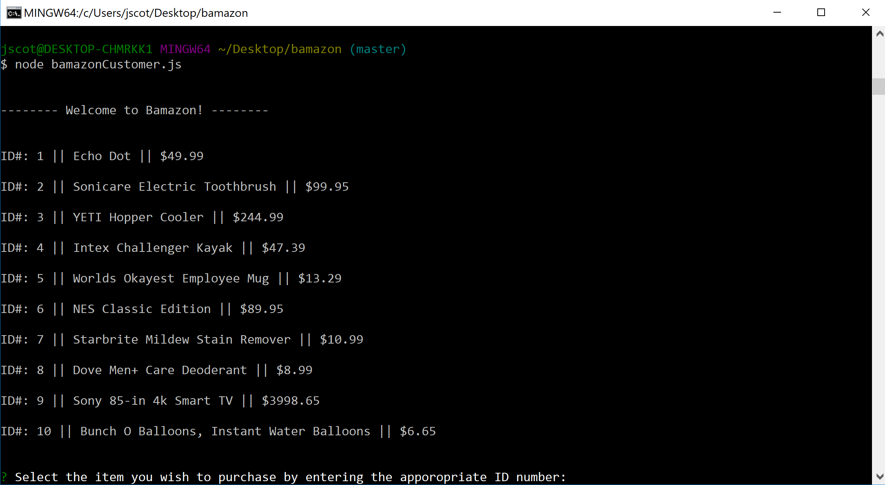
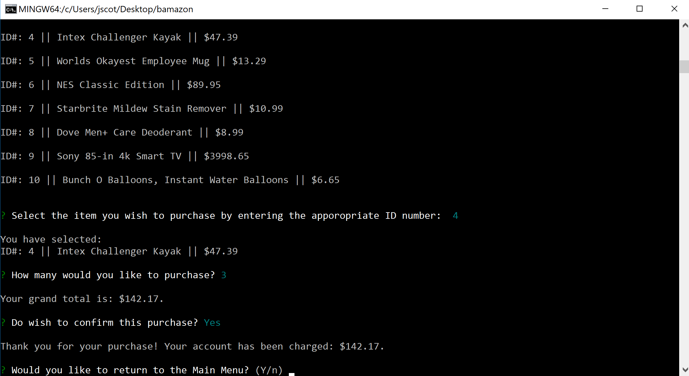

# Bamazon

Contains two separate node apps (bamazonCustomer.js, bamazonManager.js) that interact with an inventory database.

## Getting Started

Using node you can run bamazonCustomer.js to interact with the inventory as a customer. Running bamazonManager.js will allow you to interact with the inventory as a manager.

Customers can select an item by using the ID number...

The app will then ask you for the total amount you wish to purchase.

After the amount is entered the app will give you the total cost for the selected items and allow you to complete the purchase.

Managers can view all inventory items, view items with low inventory, add new inventory to existing items and add new items to the inventory.

